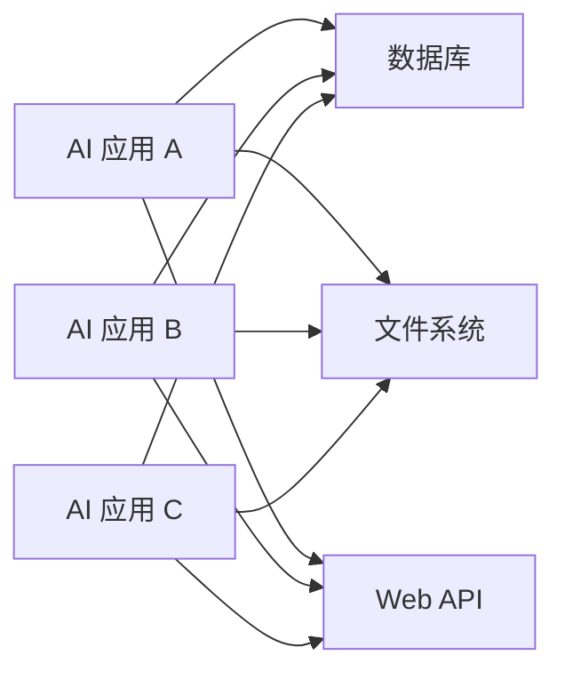
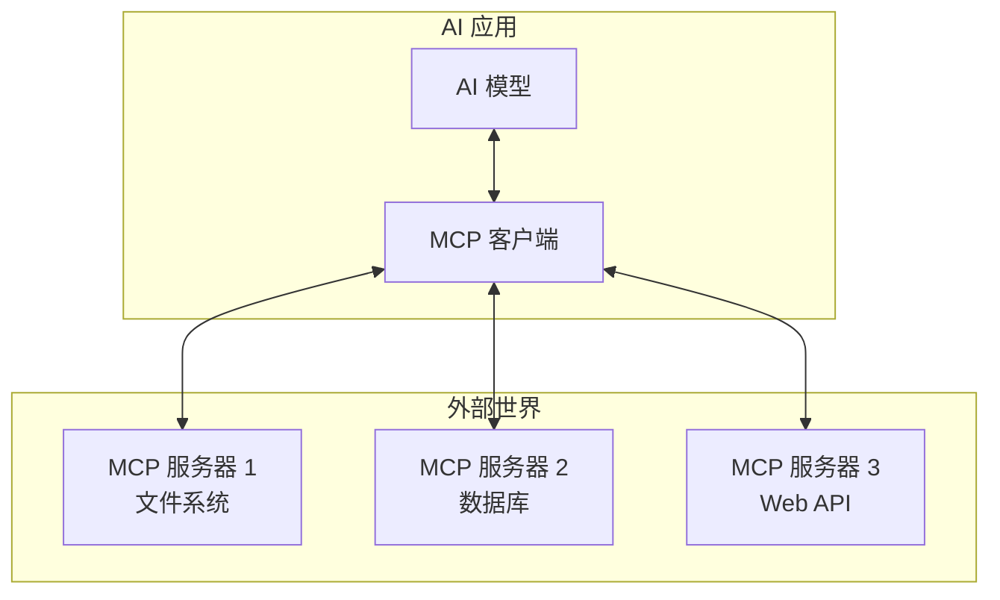

# MCP 基础概念

## 什么是 MCP？

Model Context Protocol (MCP) 是一个开放标准，旨在让 AI 模型能够安全、标准化地访问外部工具、数据和服务。简单来说，MCP 就像是 AI 和外部世界之间的"翻译官"，让 AI 能够理解和使用各种外部资源。

### 为什么需要 MCP？

在 MCP 出现之前，每个 AI 应用都需要自己实现与外部服务的集成：



这种方式存在几个问题：

1. **重复开发**：每个应用都要重新实现相同的集成逻辑
2. **不一致的接口**：不同应用使用不同的方式访问相同的资源
3. **安全风险**：缺乏统一的安全标准
4. **维护成本高**：每个集成都需要单独维护

## MCP 的核心价值

MCP 通过提供标准化的协议解决了这些问题：

### 1. 标准化接口
所有 MCP 服务器都使用相同的协议，AI 应用只需要学会如何与 MCP 协议通信，就能访问所有兼容的服务。

### 2. 安全性
MCP 内置了权限管理和安全机制，确保 AI 只能访问被授权的资源。

### 3. 可复用性
一个 MCP 服务器可以被多个 AI 应用同时使用，避免重复开发。

### 4. 扩展性
新的功能和服务可以很容易地通过创建新的 MCP 服务器来添加。

## MCP 的架构和工作原理

MCP 采用客户端-服务器架构：



### 核心组件

#### 1. MCP 客户端
- 集成在 AI 应用中
- 负责与 MCP 服务器通信
- 将 AI 的需求转换为 MCP 协议消息

#### 2. MCP 服务器
- 提供具体的功能和服务
- 实现 MCP 协议标准
- 可以访问文件系统、数据库、API 等外部资源

#### 3. MCP 协议
- 定义客户端和服务器之间的通信标准
- 基于 JSON-RPC 2.0
- 支持三种主要的资源类型

## MCP 的三种核心资源类型

### 1. 工具 (Tools)
工具是 AI 可以调用的函数，用于执行特定的操作。

**概念解释**：想象工具就像是你给 AI 的"法宝"，AI 可以在需要的时候调用这些工具来完成任务。

**示例场景**：
- 文件操作工具（读取、写入、删除文件）
- 计算工具（数学计算、数据处理）
- 通信工具（发送邮件、发送消息）

```json
{
  "name": "read_file",
  "description": "读取指定路径的文件内容",
  "inputSchema": {
    "type": "object",
    "properties": {
      "path": {
        "type": "string",
        "description": "要读取的文件路径"
      }
    },
    "required": ["path"]
  }
}
```

### 2. 资源 (Resources)
资源是 AI 可以访问的数据源，通常是只读的信息。

**概念解释**：资源就像是"信息库"，AI 可以从中获取需要的信息，但通常不能修改。

**示例场景**：
- 配置文件的内容
- 数据库中的记录
- 网页内容
- 文档和知识库

```json
{
  "uri": "file://config.json",
  "name": "应用配置",
  "description": "当前应用的配置信息",
  "mimeType": "application/json"
}
```

### 3. 提示词 (Prompts)
提示词是预定义的模板，用于指导 AI 如何处理特定类型的任务。

**概念解释**：提示词就像是"使用说明书"，告诉 AI 在特定情况下应该如何思考和回应。

**示例场景**：
- 代码审查提示词
- 文档写作模板
- 问题解答指南
- 创意写作框架

```json
{
  "name": "code_review",
  "description": "代码审查提示词模板",
  "arguments": [
    {
      "name": "code",
      "description": "要审查的代码",
      "required": true
    },
    {
      "name": "language",
      "description": "编程语言",
      "required": false
    }
  ]
}
```

## MCP 与传统 API 的区别

### 传统 API 方式

```python
# 传统方式：每个服务都有不同的接口
import requests
import sqlite3
import os

# 调用 Web API
response = requests.get("https://api.example.com/data")
data = response.json()

# 访问数据库
conn = sqlite3.connect("database.db")
cursor = conn.execute("SELECT * FROM users")
users = cursor.fetchall()

# 读取文件
with open("config.txt", "r") as f:
    config = f.read()
```

**问题**：
- 每种服务都需要不同的学习成本
- 错误处理方式不统一
- 安全机制各不相同
- 难以统一管理和监控

### MCP 方式

```python
# MCP 方式：统一的接口
from mcp import Client

# 创建 MCP 客户端
client = Client()

# 连接到不同的 MCP 服务器，但使用相同的接口
await client.connect("filesystem-server")
await client.connect("database-server") 
await client.connect("web-api-server")

# 使用统一的方式调用工具
file_content = await client.call_tool("read_file", {"path": "config.txt"})
users = await client.call_tool("query_database", {"sql": "SELECT * FROM users"})
api_data = await client.call_tool("fetch_api", {"url": "https://api.example.com/data"})
```

**优势**：
- 统一的学习曲线
- 一致的错误处理
- 统一的安全模型
- 集中的监控和管理

## 工作流程示例

让我们通过一个具体的例子来理解 MCP 的工作流程：

### 场景：AI 助手帮助分析日志文件

1. **用户请求**："请分析昨天的错误日志，找出最常见的错误类型"

2. **AI 分析需求**：
   - 需要读取日志文件
   - 需要过滤错误信息
   - 需要统计和分析

3. **MCP 客户端发现可用工具**：
   ```json
   {
     "method": "tools/list",
     "id": 1
   }
   ```

4. **MCP 服务器返回可用工具**：
   ```json
   {
     "result": {
       "tools": [
         {
           "name": "read_file",
           "description": "读取文件内容"
         },
         {
           "name": "filter_logs",
           "description": "过滤日志中的错误信息"
         },
         {
           "name": "analyze_errors",
           "description": "分析错误模式"
         }
       ]
     }
   }
   ```

5. **AI 调用工具完成任务**：
   ```python
   # 1. 读取日志文件
   log_content = await client.call_tool("read_file", {
       "path": "/var/log/app-2024-01-15.log"
   })
   
   # 2. 过滤错误信息
   errors = await client.call_tool("filter_logs", {
       "content": log_content,
       "level": "ERROR"
   })
   
   # 3. 分析错误模式
   analysis = await client.call_tool("analyze_errors", {
       "errors": errors
   })
   ```

6. **返回分析结果**：AI 将分析结果整理成用户容易理解的格式。

## 小结

MCP 的核心价值在于：

1. **标准化**：提供统一的接口和协议
2. **安全性**：内置权限管理和安全机制
3. **可扩展性**：易于添加新功能和服务
4. **效率**：避免重复开发，提高开发效率

在下一章中，我们将学习如何实际使用现有的 MCP 服务器，让你亲身体验 MCP 的强大功能。

---

## 延伸阅读

- [MCP 官方规范](https://spec.modelcontextprotocol.io/)
- [Claude Desktop 中的 MCP 支持](https://docs.anthropic.com/en/docs/build-with-claude/computer-use)
- [MCP 社区和生态系统](https://github.com/modelcontextprotocol)